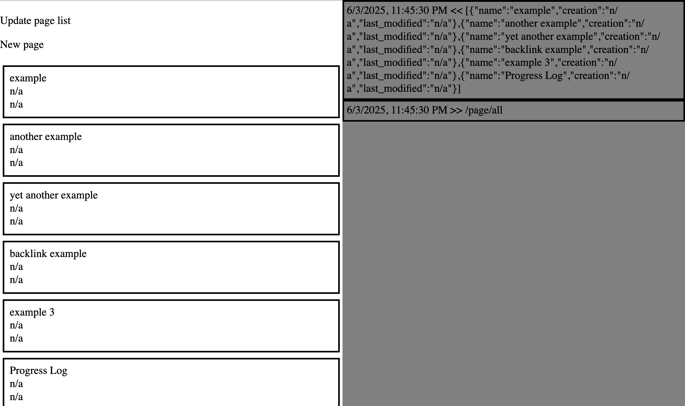

## Elegant Notes
A simple, easy to use note-taking application. This system strives for organization with a parent/child relationship in the format of bullet-point lists.

## Notice
This is still a work in progress. See the [roadmap](./roadmap.md) of the project with planned features for V1.0. Current state of everything:

This shows the actual application on the left with traffic on the right

### WIP Status
- This system is under heavy development and will have different aspects change quickly
- Frontend is based on [Logseq](https://logseq.com/) but needs more work
- Backend is sending text (JSON) that is not encrypted (yet)
- Database needs to be changed to another client - [TerminusDB](https://github.com/terminusdb/terminusdb) lacks features on Python client and there does not seem to be a push to fix that
